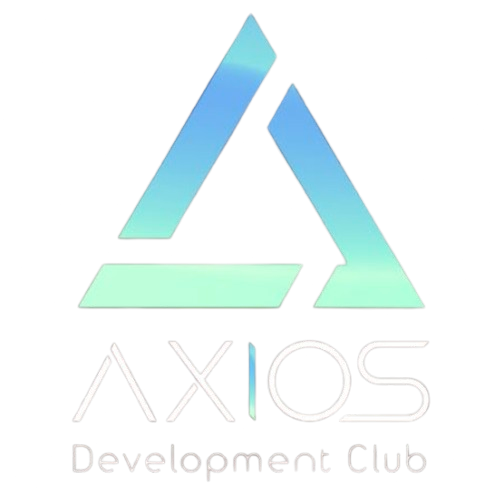

<div align="center">
  

  <h1>Axios - Technical Club of IIIT Bhopal</h1>

  <p>Empowering Future Engineers through Real-World Tech Exposure</p>

  <p><strong>Website</strong> • <a href="https://axios.iiitbhopal.ac.in" target="_blank">Live Demo</a></p>

  <br/>

  
  
  
</div>

---

## 📌 About Axios

**Axios** is the official technical club of **IIIT Bhopal**, focused on guiding students through hands-on experience in real-world technologies. From Web and App Development to AI/ML, Data Science, and VLSI — we shape tech-savvy engineers of tomorrow.

---

## 🚀 Tech Stack

- **Next.js** — App Router
- **TailwindCSS** — Utility-first CSS
- **Framer Motion** — Animations
- **Three.js** — 3D experiences (where used)

---

## 🧠 Domains We Cover

- Web Development  
- App Development  
- AI/ML  
- Data Science  
- Cloud & DevOps  
- VLSI  
- Game Development  

---

## 📸 Sections Included

- Hero Banner with 3D/Spotlight Animation  
- Events Section (with past event highlights)  
- Domains Grid  
- Vision, Mission, and Goals  
- Team and Contact Info  
- Footer with Social Media Links  

---

## 📂 Setup Locally

### Requirements

- Node.js >= 18
- npm or yarn

### Install & Run

```bash
git clone https://github.com/axios-iiitbhopal/website.git
cd website
npm install
npm run dev
